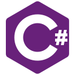

My name is Rafael Vieira dos Santos

I'm student of Software Engineer looking for experience with Home Office work,
Systems Analysis and Development 2011 to 2017 UTFPR. I started the
administration course in 2020 to have experience with management and management
processes, and a degree in Software Engineering to update myself to the job
market.
## Contact:
<div>
<a href = "mailto:rvsfara@gmail.com"></a>
<a href="https://www.linkedin.com/in/rvsfara" target="_blank"></a>
<a href="https://rvsfara.github.io/" target="_blank"></a>
</div>

* 🌍  I'm based in Santa Maria, RS, Brazil

<b>My GitHub Stats</b>


## Skills
<details>
    <summary>Click to Display</summary>





</a>


</details>
## Learning Skills
<details>
    <summary>Click to Display</summary>


</a>


</details>
### Socials

<a href="https://www.behance.com/rvsfara" target="_blank"> </a>
<a href="https://www.dev.to/rvsfara" target="_blank" rel="noreferrer"></a>
<a href="https://www.dribbble.com/rvsfara" target="_blank" rel="noreferrer"></a>
<a href="https://www.github.com/rvsfara" target="_blank" rel="noreferrer"></a>
<a href="https://www.linkedin.com/in/rvsfara" target="_blank" rel="noreferrer"></a>
<a href="http://www.medium.com/rvsfara" target="_blank" rel="noreferrer"></a>
<a href="https://www.stackoverflow.com/users/rvsfara" target="_blank" rel="noreferrer"></a>

### Support Me

<a href="https://www.buymeacoffee.com/rvsfara">

<details>
    <summary>Badges Loading</summary>
Languages


JS Framework/Library


CSS Framework/Library/Pre-processors


Design/Visual Tools


Database/State


Backend


Web Hosting


CI/CD

 https://docs.github.com/pt/actions


Package Manager


Version Control


</details>


## Ferramentas e Tecnologias


## Main Operating System


``` java
if (codeWorking){
            while (codeQuality < perfectCode){
                codeQuality++;
            }
}
```

### Thanks for Visiting my GitHub Profile!
